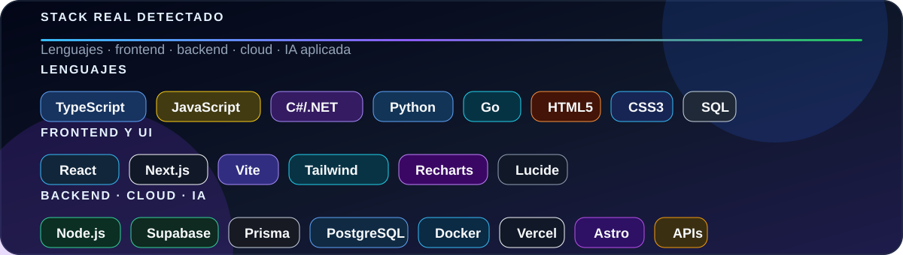

  

  <a href="https://orcid.org/0009-0006-4569-6920">ORCID</a>

  
  
  

  
  
  
  
  
  
  
  

  
  
  
  
  
  
  

  
  
  
  
  
  
  

  

  

## Hola, soy Fredy 👋

Soy **Fredy Luis Vidalón Lozano**, estudiante de **Ingeniería Informática** en Tijuana, Baja California. Me interesa crear soluciones web útiles, claras y bien organizadas, con enfoque en educación, gestión de información e integración de inteligencia artificial.

## Enfoque actual

- Desarrollo web con React, Next.js, Astro, Vite, TypeScript, JavaScript, HTML5, CSS3 y Tailwind CSS.
- Backends, datos e integraciones con Node.js, Express, Supabase, Prisma, PostgreSQL, Docker, Vercel y APIs.
- Práctica académica con C#/.NET, Python, Go y SQL.
- Exploración de sitios modernos con Astro e inteligencia artificial aplicada en productos web.
- Interfaces para educación, administración, análisis y consulta de información.
- Aprendizaje constante, mejora técnica y construcción de soluciones con propósito.

---

  <strong>Tijuana, Baja California</strong> &nbsp; · &nbsp; Lvltech Mx 
  Aprender, construir y seguir mejorando.

