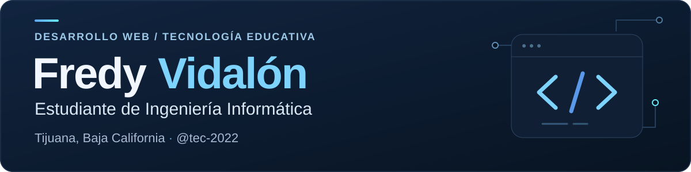

  

  <a href="https://github.com/tec-2022?tab=repositories">Explorar proyectos</a>
  &nbsp; · &nbsp;
  <a href="https://orcid.org/0009-0006-4569-6920">ORCID</a>

## Hola, soy Fredy 👋

Soy **Fredy Luis Vidalón Lozano**, estudiante de **Ingeniería Informática** en Tijuana, Baja California. Desarrollo proyectos web que conectan educación, gestión de información e integración de inteligencia artificial.

En este espacio comparto aplicaciones, prácticas y proyectos de aprendizaje: desde bibliotecas virtuales hasta herramientas de retroalimentación académica y sitios con asistentes de IA.

## Proyectos destacados

| Proyecto | Qué encontrarás |
| :--- | :--- |
| **[Encuesta de cursos](https://github.com/tec-2022/encuesta-curso)** | Retroalimentación académica con formularios, panel de métricas y reportes.   Next.js · TypeScript · Supabase · Recharts |
| **[Biblioteca virtual](https://github.com/tec-2022/bbotk)** | Catálogo con búsqueda y filtros, acceso de usuarios y administración de libros.   Next.js · TypeScript · Prisma |
| **[LVL Tech](https://github.com/tec-2022/lvltechmx)** | Sitio web con un chat integrado con la API de Google Gemini.   JavaScript · HTML · CSS · Gemini API |

## Tecnologías en mis proyectos

**Desarrollo web** &nbsp; `TypeScript` `JavaScript` `React` `Next.js` `Tailwind CSS`

**Datos e integraciones** &nbsp; `Supabase` `Prisma` `Google Gemini API`

---

  <strong>Tijuana, Baja California</strong> &nbsp; · &nbsp; Lvltech Mx 
  Aprender, construir y seguir mejorando.

